# 📊 Excel-14

## ✨ Project Description

**Excel-14** is a guide to advanced data handling features in Microsoft Excel.  
Here you'll find step-by-step instructions, tips, and 47 illustrative screenshots covering:

- Filtering data
- Advanced Filter (including AND/OR logic and formulas)
- Data Form
- Remove Duplicates
- Outlining Data and Subtotals
- SUBTOTAL function
- Unique Values (UNIQUE function)
- FILTER function

> 📚 **Goal:** Help you manage, clean, and analyze data in Excel—using built-in tools and modern dynamic formulas!

---

## 📒 Table of Contents

- [🔎 Filter Data](#-filter-data)
- [🔢 Number and Text Filters](#-number-and-text-filters)
- [📅 Date Filters](#-date-filters)
- [🧮 Advanced Filter](#-advanced-filter)
- [🗃️ Data Form](#-data-form)
- [🚫 Remove Duplicates](#-remove-duplicates)
- [📐 Outlining Data](#-outlining-data)
- [➕ SUBTOTAL function](#-subtotal-function)
- [🔄 Automatic Subtotals](#-automatic-subtotals)
- [🧩 Unique Values](#-unique-values)
- [🧹 FILTER function](#-filter-function)
- [📷 Screenshots](#-screenshots)
- [ℹ️ Requirements](#-requirements)
- [👨‍💻 Author](#-author)

---

## 🔎 Filter Data

Excel makes it easy to filter data and display only what you need:

1. Click any cell inside your dataset.
2. On the **Data** tab, in the **Sort & Filter** group, click **Filter**.
   
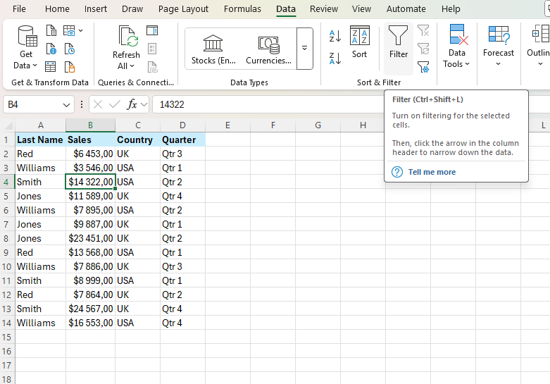

Arrows in the column headers appear.

3. Click the arrow next to **Country**.
4. Click on **Select All** to clear all checkboxes, then check **USA**.

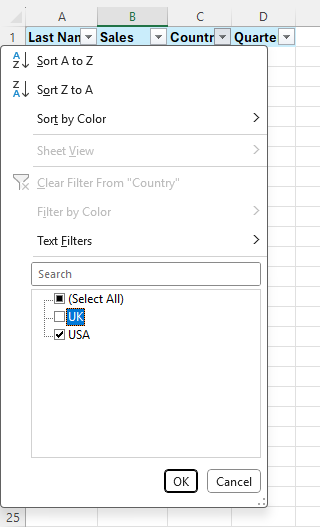

5. Click **OK**.

Result: Only sales from the USA are displayed.

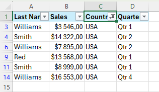

6. Click the arrow next to **Quarter**.
7. Again, clear all checkboxes, and check **Qtr 1**.

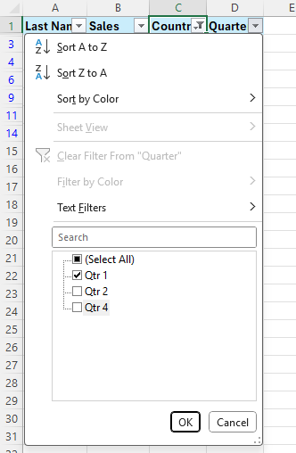

8. Click **OK**.

Now, only sales from USA in Qtr 1 are shown.

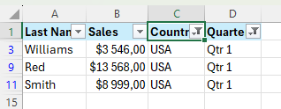

To remove filters, use the **Clear** button on the Data tab.  
To remove arrows, click **Filter** again.

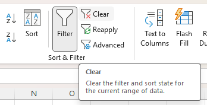

### ⏩ Quick Filtering

- Select a cell.
- Right-click → Filter → **Filter by Selected Cell's Value**.

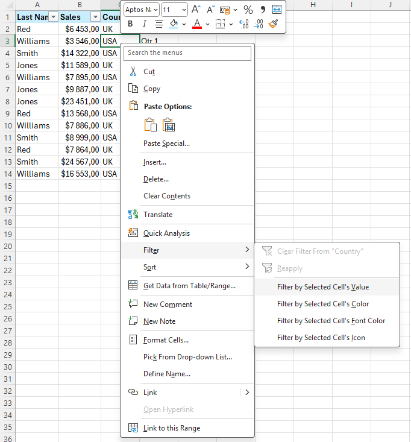

---

## 🔢 Number and Text Filters

Apply filters based on numbers or text:

1. Click any cell in the dataset.
2. Data tab → Filter (arrows appear).

To filter numbers:

1. Click the arrow next to **Sales**.
2. Choose **Number Filters** → **Greater Than**.

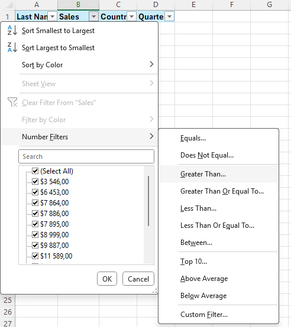

3. Enter `10,000` and click OK.

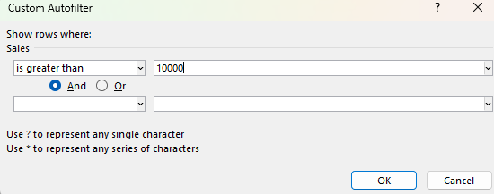

Result: Only records with Sales > $10,000.

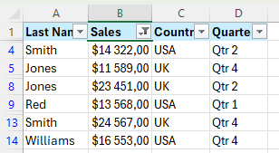

To filter text:

1. Clear previous filters (Data → Clear).
2. Arrow next to **Last Name** → **Text Filters** → **Equals**.

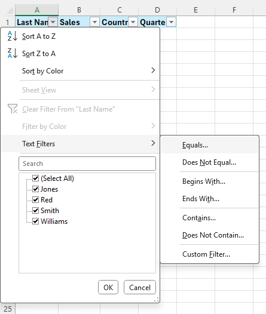

3. Enter `?m*` and click OK.

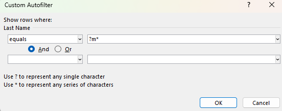

> `?` matches one character, `*` matches any number of characters.

Result: Only records where the second character of Last Name is "m".

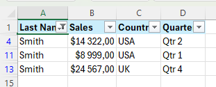

---

## 📅 Date Filters

1. Click any cell inside your dataset.
2. Data tab → Filter.
3. Arrow next to **Date**.
4. Clear all, expand **2021**, check **May**.

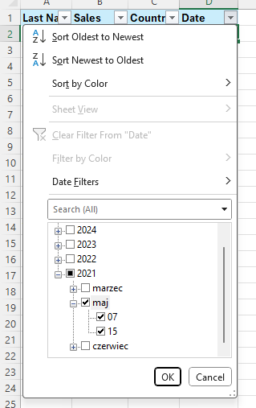

5. Click OK.

Result: Only sales from May 2021.

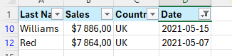

To filter for "Last Year":

1. Select all, then **Date Filters** → **Last Year**.

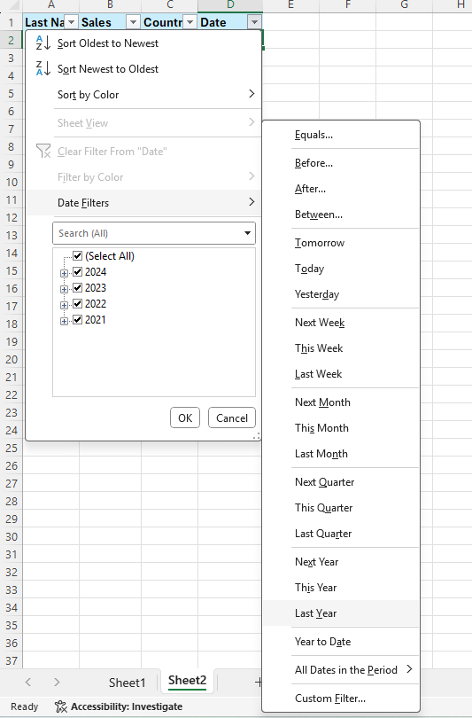

Result: Sales from last year.

> Many date filters depend on today's date.

---

## 🧮 Advanced Filter

Advanced Filter lets you use more complex criteria (AND/OR, formulas).

### AND Criteria

To show sales in USA AND Qtr 4:

1. Enter criteria.
2. Select any cell in dataset.
3. Data tab → Advanced.

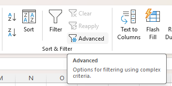

4. Set Criteria range to `A1:D2`.

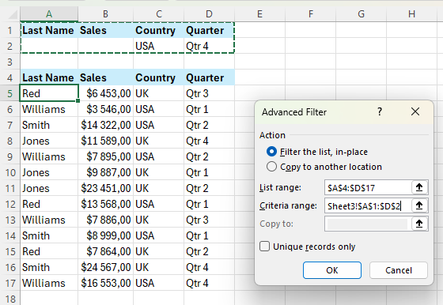

5. Click OK.

Result:

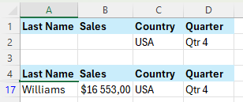

> This could be done with normal filter, but Advanced Filter is required for OR or formula criteria.

### OR Criteria

Show sales for USA in Qtr 4 OR UK in Qtr 2:

1. Enter criteria.
2. Data tab → Advanced, set Criteria range to `A1:D3`.

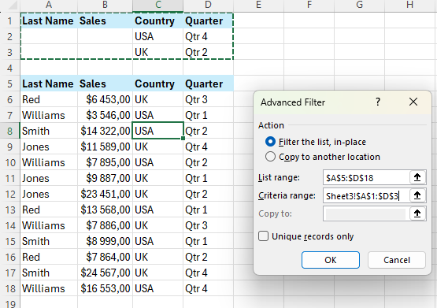

3. Click OK.

Result:

### Formula as Criteria

Show sales for USA in Qtr 4 OR UK in Qtr 2, but only if Sales > $10,000:

1. Enter criteria (e.g., formula: `=B6>10000`) on worksheet.
2. Data tab → Advanced, set Criteria range to `A1:E3`.

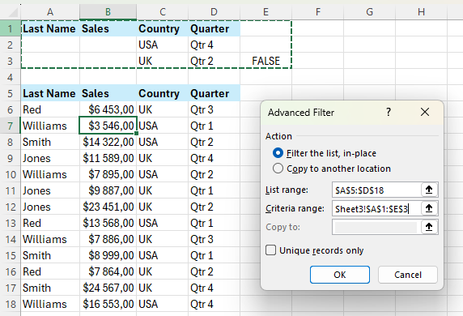

3. Click OK.

Result:

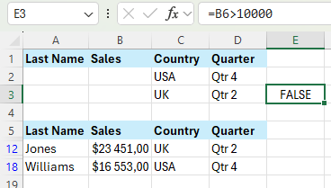

> Place formulas in a new column, not labeled as in your dataset. Use relative references.

---

## 🗃️ Data Form

Excel’s Data Form lets you add, edit, delete, and search records—great for wide tables.

To enable:

1. Add Form command to Quick Access Toolbar:
   - Click down arrow → More Commands
   - Choose "Commands Not in the Ribbon"
   - Select **Form** and click **Add**

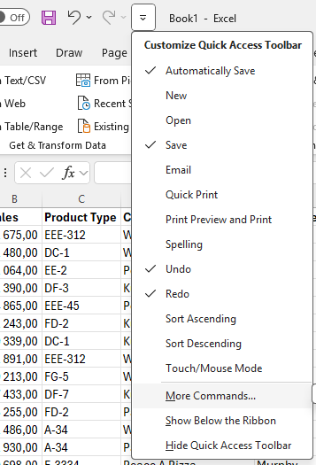
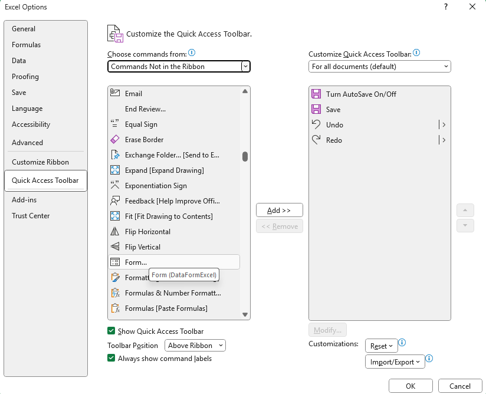
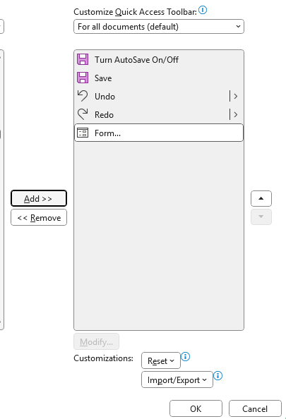

2. Click OK. Now Form is on your toolbar.

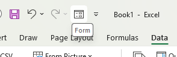

To use:

1. Select any cell, click Form.

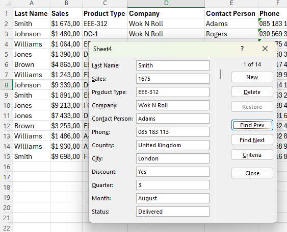

Use **Find Prev/Next** to browse records.  
Use **New** or **Delete** to add/remove records.  
Use **Restore** to undo changes.

To search by criteria:

1. Click **Criteria**.

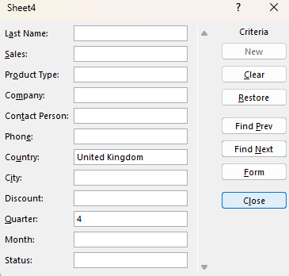

2. Enter criteria and click Form.

Now only records matching criteria appear when using Find Prev/Next.

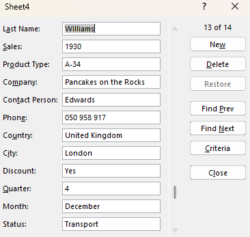

---

## 🚫 Remove Duplicates

Quickly remove duplicate rows:

1. Select any cell in dataset.
2. Data tab → Data Tools group → Remove Duplicates.

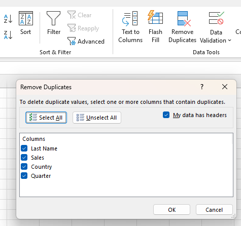

Result: All identical rows (except the first) are removed.

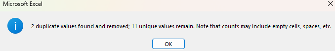

> To keep duplicates but extract unique rows, use **Advanced Filter**.

---

## 📐 Outlining Data

Outlining helps organize and summarize data:

1. Sort data by **Company**.

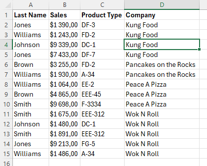

2. Data tab → Outline group → Subtotal.

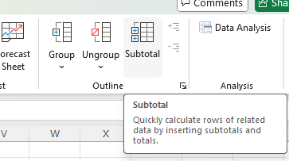

3. Select Company column, Count function, check Company.

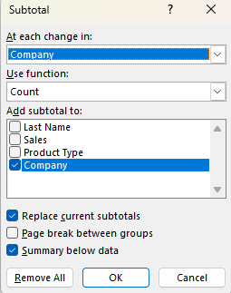

4. Click OK.

Result:

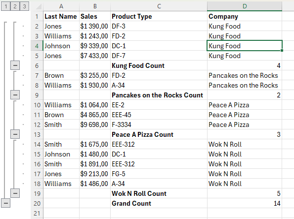

To collapse/expand groups, use minus signs or level numbers.

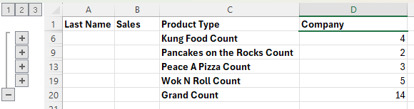

> Remove outline: Data tab → Outline group → Subtotal → Remove all.

---

## ➕ SUBTOTAL function

Use SUBTOTAL instead of SUM/COUNT/MAX to ignore filtered/hidden rows.

SUM counts all rows; SUBTOTAL ignores those hidden by filter.

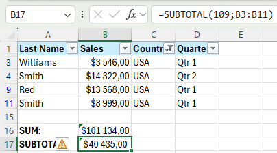

> Argument 109 = SUM for SUBTOTAL. Use Excel’s autocomplete to see function numbers.

---

## 🔄 Automatic Subtotals

Create a table, add a total row at the bottom:

1. Filter by Country.
2. Add total row: Table Design → **Total Row**.

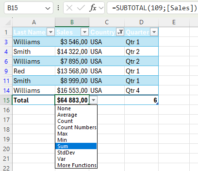
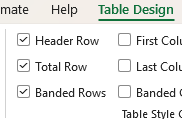

Second way: Data tab → Outline group → Subtotal.

---

## 🧩 Unique Values

With Excel 365/2021, use UNIQUE to extract unique values:

Basic UNIQUE formula:

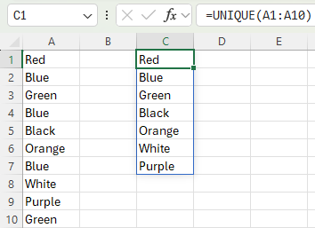

UNIQUE for values that occur only once:

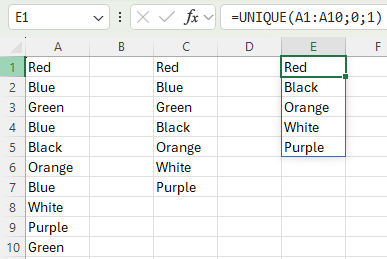

> UNIQUE takes 2 optional arguments:  
> - 2nd arg: 0 = vertical array.  
> - 3rd arg: 1 = only items that occur once.

If you don’t have Excel 365/2021, use **Advanced Filter** for unique values.

---

## 🧹 FILTER function

Excel 365/2021: Use FILTER for powerful criteria-based extraction.

Filter all USA records:

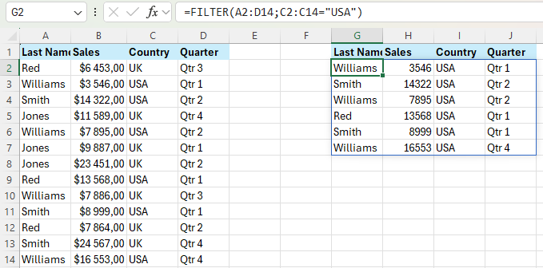

Filter where Sales > $10,000 AND Country = USA:

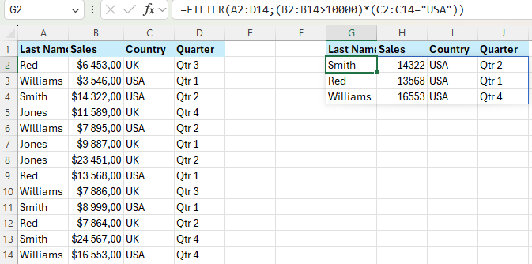

Filter where Last Name = "Smith" OR "Williams":

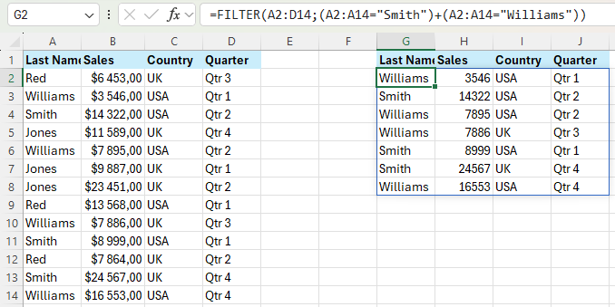

Sort records with SORT:

---

## 📷 Screenshots

All 47 screenshots referenced above are available in the `/Screenshots` folder.

---

## ℹ️ Requirements

- Microsoft Excel (recommended: 2021/365 for modern formulas)
- Windows OS (for some features like Data Form command)

---

## 👨‍💻 Author

Project and documentation by **Kuba27x**  
Repository: [Kuba27x/Excel-14](https://github.com/Kuba27x/Excel-14)

---
