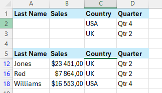

Excel-14

Project Description

Excel-14 is a guide to filtering data in Excel. Here you'll find practical tips, instructions, and illustrations about working with filters, advanced filters, Data Forms, removing duplicates, Outlining data, unique values, SUBTOTAL function, UNIQUE function, FILTER function.

Table of Contents

Filter Data

1. Click any single cell inside a data set.
2. On the Data tab, in the Sort & Filter group, click Filter.
 

Arrows in the column headers appear.

3. Click the arrow next to Country.
4. Click on Select All to clear all the check boxes, and click the check box next to USA.

5. Click OK.

Result: Excel only displays the sales in the USA.

6. Click the arrow next to Quarter.
7. Click on Select All to clear all the check boxes, and click the check box next to Qtr 1.

8. Click OK.

Result: Excel only displays the sales in the USA in Qtr 1.

9. To remove the filter, on the Data tab, in the Sort & Filter group, click Clear. To remove the filter and the arrows, click Filter.

   

There's a quicker way to filter Excel data.

10. Select a cell.
11. Right click, and then click Filter, Filter by Selected Cell's Value.

   

Result: Excel only displays the sales in the USA.

Number and Text Filters

1. Click any single cell inside a data set.
2. On the Data tab, in the Sort & Filter group, click Filter. Arrows in the column headers appear.

To apply a number filter, execute the following steps.

1. Click the arrow next to Sales.
2. Click Number Filters (this option is available because the Sales column contains numeric data) and select Greater Than from the list.

   

3. Enter 10,000 and click OK.
   
   

Result: Excel only displays the records where Sales is greater than $10,000.

   

Text Filter

To apply a text filter, execute the following steps.

1. First, to remove the previously applied filter, on the Data tab, in the Sort & Filter group, click Clear.
2. Next, click the arrow next to Last Name.
3. Click Text Filters (this option is available because the Last Name column contains text data) and select Equals from the list.

   

4. Enter ?m* and click OK.

   

(Note: a question mark (?) matches exactly one character. An asterisk (*) matches a series of zero or more characters.)

Result: Excel only displays the records where the second character of Last Name equals m.

   

Date Filters

1. Click any single cell inside a data set.
2. On the Data tab, in the Sort & Filter group, click Filter. Arrows in the column headers appear.
3. Click the arrow next to Date.
4. Click on Select All to clear all the check boxes, click the + sign next to 2021, and click the check box next to maj (May).

   

5. Click OK.
   
Result: Excel only displays the sales in 2021, in May.

   

6. Click the arrow next to Date.
7. Click on Select All to select all the check boxes.
8. Click Date Filters (this option is available because the Date column contains dates) and select Last Year from the list.

   

Result: Excel only displays the sales of last year.

   

(Note: this date filter and many other date filters depend on today's date.)

Advanced Filter

And Criteria

To display the sales in the USA and in Qtr 4, execute the following steps.

1. Enter the criteria.
2. Click any single cell inside the data set.
3. On the Data tab, in the Sort & Filter group, click Advanced.

   

4. Click in the Criteria range box and select the range A1:D2.

   

6. Click OK.

Result:

   

(Note: We can achieve the same result with the normal filter. Advanced filter will be useful for Or criteria.)

Or Criteria

To display the sales in the USA in Qtr 4 or in the UK in Qtr 2, execute the following steps.

1. Enter the criteria on the worksheet.
2. On the Data tab, in the Sort & Filter group, click Advanced, and adjust the Criteria range to range A1:D3.

   

3. Click OK.

Result:

   

Formula as Criteria

To display the sales in the USA in Qtr 4 or in the UK in Qtr 2 greater than $10.000, execute the following steps.

1. Enter the criteria (+formula: =B6>10000) on the worksheet.
2. On the Data tab, in the Sort & Filter group, click Advanced, and adjust the Criteria range to range A1:E3.

  

3. Click OK.

Result:

  

(Note: always place a formula in a new column. Do not use a column label or use a column label that is not in your data set. Create a relative reference to the first cell in the column (B6). The formula must evaluate to TRUE or FALSE.)

Data Form

The data form in Excel allows you to add, edit and delete records (rows) and display only those records that meet certain criteria. Especially when you have wide rows and you want to avoid repeated scrolling to the right and left, the data form can be useful.

To use the Form command you need to add it to the Quick Access Toolbar first.

Here is how to do it:

1. Click the down arrow.
2. Click More Commands.

  

3. Under Choose commands from, select Commands Not in the Ribbon.
4. Select a command and click Add.

  
  

5.  Click OK.
6. You can now find this command on the Quick Access Toolbar.

  

Let`s use it now.

1. Select any cell.
2. Click the Form command.

  

Use the Find Prev and Find Next buttons to easily switch from one record (row) to another.

(Note: use the New or Delete button to add or delete records. Once you start editing a record, you can use the Restore button to undo any changes you make.)

3. To display only those records that meet certain criteria, click the Criteria button.

  

4. Enter the criteria and click the Form button.

Now, when you use the Find Prev and Find Next buttons, you will only see those records that meet these criteria.

  

Remove Duplicates

To quickly remove duplicates in Excel, use the tool on the Data tab. Use the Advanced Filter if you don't want to delete duplicates permanently.

1. Click any single cell inside the data set.
2. On the Data tab, in the Data Tools group, click Remove Duplicates.

  

Result: Excel removes all identical rows except for the first identical row found.

  

(Note: If you prefer not to delete duplicates permanently, use the Advanced Filter to extract unique rows (or values in a column).)

Outlining Data

Outlining data makes your data easier to view. In this example, we will total rows of related data and collapse a group of columns.

1. First, sort the data on the Company column.

  

2. On the Data tab, in the Outline group, click Subtotal.

3. Select the Company column, the column we use to outline our worksheet.
4. Use the Count function.
5. Check the Company check box.

6. Click OK.

Result:

7. To collapse a group of cells, click a minus sign. You can use the numbers to collapse or expand groups by level. For example, click the 2 to only show the subtotals.

(Note: To remove the outline, click any cell inside the data set and on the Data tab, in the Outline group, click Subtotal, Remove all.)

SUBTOTAL function

Use the SUBTOTAL function in Excel (instead of SUM, COUNT, MAX, etc.) to ignore rows hidden by a filter or to ignore manually hidden rows.

For example, the SUM function below calculates the total sales.
The SUBTOTAL function ignores rows hidden by a filter and calculates the correct result.

(Note: 109 is the argument for Sum if you use the SUBTOTAL function. It's not easy to remember which argument belongs to which function. Fortunately, the AutoComplete feature in Excel helps you with this.)

Automatic Subtotals

Create a table and add a total row to the bottom of the table. Next, click any cell in the last row to automatically add a SUBTOTAL function.

In this example, we also filtered by Country

To add a total row to the bottom of the table tick Total Row field in Table Design:

(Note: The second way: On the Data tab, in the Outline group, click Subtotal to outline your data.)

Unique Values

If you have Excel 365 or Excel 2021, use the UNIQUE function to extract unique values.

The UNIQUE function below (with no extra arguments) extracts unique values.

The UNIQUE function below extracts values that occur exactly once.

(Note: the UNIQUE function has 2 optional arguments. The default value of 0 (second argument) tells the UNIQUE function to extract values from a vertical array. The value 1 (third argument) tells the UNIQUE function to extract values that occur exactly once.)
(Note: If you dont have Excel 365 or Excel 2021, use the Advanced Filter to extract unique values or filter for unique values.)

FILTER function

Use the FILTER function in Excel 365/2021 to extract records that meet certain criteria. The FILTER function is quite versatile.

The simple FILTER function below has two arguments and extracts all USA records

The FILTER function below uses the multiplication operator (*) to extract all records where Sales is greater than $10,000 and Country equals "USA".

The FILTER function below uses the addition operator (+) to extract all records where Last Name equals "Smith" or Last Name equals "Williams".

Add the SORT function to sort the records by the first column.

